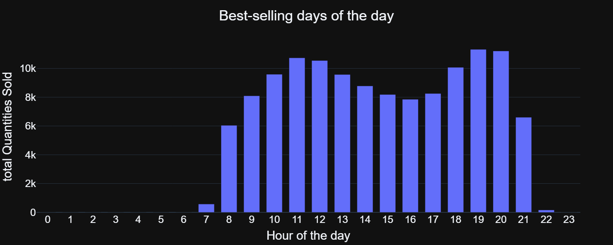
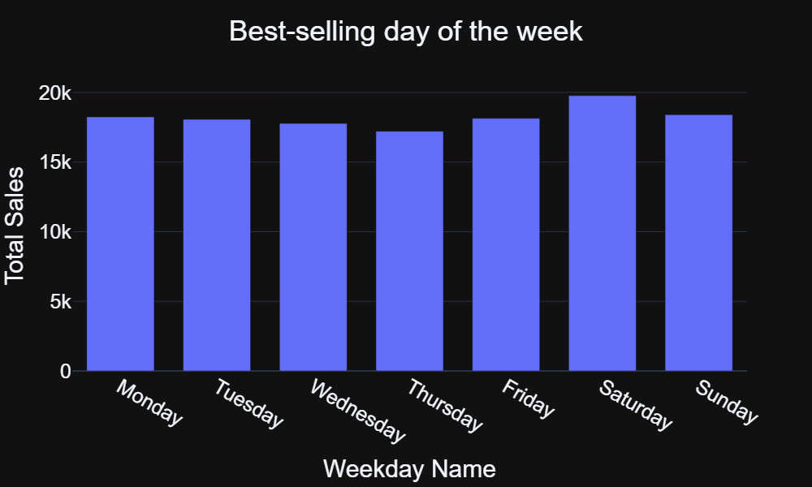

# 💊 Pharma Sales & Operations Data Analytics

An end-to-end data analytics project focused on optimizing pharmacy operations, inventory management, and staffing using Python and Plotly.

> 🚀 **[Click here to view the Interactive & Dynamic Charts (NBViewer)](https://nbviewer.org/github/mohammedmegahed2010-del/pharmacy-sales-data-analysis/blob/main/01-pharmacy-sales-insights/main.ipynb)**

---

## 📊 Key Insights Found
* **Peak Hour:** 19:00 (7 PM) is the highest-selling hour of the day.
* **Recession/Quiet Hours:** Sales drop significantly between 22:00 (10 PM) and 07:00 (7 AM).
* **Best-Selling Product:** `N02BE` (Paracetamol) is the highest-selling drug category by a huge margin.

## 💡 Business Recommendations
* **Staffing Optimization:** Minimize night-shift staff from 22:00 to 07:00 to reduce operational costs, and maximize staff at 19:00 to handle peak traffic.
* **Inventory Management:** Maintain high safety stock levels for `N02BE` (Paracetamol) and place them near the front counter to reduce customer wait times.

---

## 📈 Interactive Project Visualizations

To view these charts with full interactivity (hover effect, exact numbers, and zooming), make sure to click the **NBViewer** link at the top of this document.

### 🕐 1. Total Sales by Hour of the Day
*This chart clearly shows the evening peak hours and the sharp decline in sales during the night shift.*

### 📅 2. Best-Selling Days of the Week
*This chart helps pharmacy management identify which days of the week require additional inventory restocking.*

